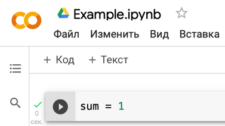
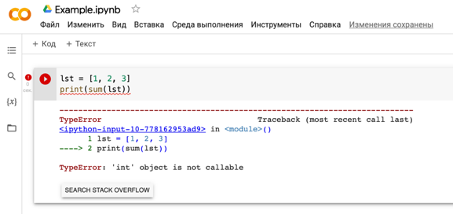

# Особенности работы с Google Colab

Как правило, в рамках данного курса предполагается использование _Google Colab_ в качестве среды разработки.

Это средство обладает рядом особенностей, которые описаны в данном документе.

## Работа с ячейками

В _Google Collab_ код следует записывать в отдельные **ячейки**. При этом важно заметить, что переменные, созданные в каких-то ячейках ранее, **могут сохраняться до перезагрузки страницы Google Colab**.

Рассмотрим такую ситуацию.

Допустим, мы создали ячейку, задали переменную с именем `sum` и запустили получившийся код:

После этого мы захотели изменить код в этой ячейке и решили задать некоторый список `lst` и посчитать сумму его элементов с помощью стандартной функции `sum()`. Мы получим такую ошибку после попытки запуска:

***Почему так произошло?***

Потому что _Google Collab_ **уже связал имя `sum` со старой переменной**, значение которой стало равным 1 после предыдущего запуска данной ячейки.

И теперь он пытается использовать число как функцию. Но это невозможно. Отсюда возникает такая ошибка.

### Способы исправления ошибки

Для исправления подобных ошибок следует выполнить следующие 2 пункта:

1. Перезагрузить в браузере страницу с _Google Collab_.
2. Стараться **не называть** обычные переменные именами, которые совпадают с зарезервированными именами (они обычно подсвечиваются коричневым: `sum`, `len` и т.д.).

