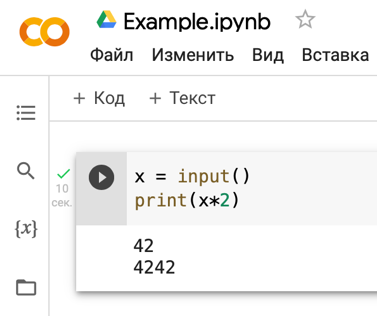
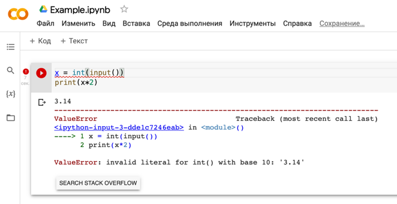
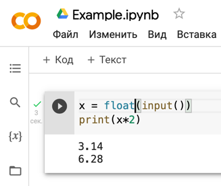
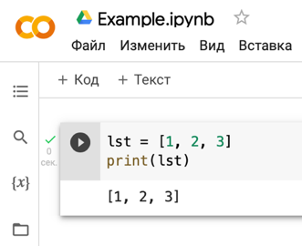
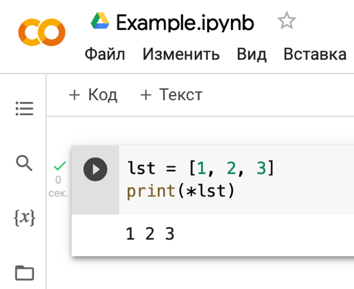
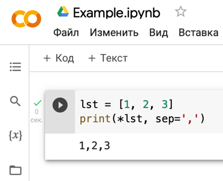

# Рекомендации по работе с вводом-выводом

Первым делом, при чтении домашних задач нужно обращать внимание на таблицу ограничений к решению задания. Она указывается в самом начале задания. В ней отображается информация об ограничении по времени работы, по памяти, а также ограничения на ввод и вывод.


Ограничения по времени и по памяти – как правило, не сильно отличаются от задачи к задаче и нужны в первую очередь для корректной работы тестовой системы. Как правило, они выбираются с некоторым запасом, поэтому можно считать, что ваша программа практические всегда будет удовлетворять этим ограничениям.

Более важно при работе с текстом условия обращать внимание на строки «Ввод» и «Вывод». В них содержится информация о том, как ваша программа будет взаимодействовать с тестовой системой.

Практически любая программа, решаемая в рамках домашних заданий, представляет собой некоторый «чёрный ящик», который каким-то образом (в соответствии с написанным вами кодом) преобразует некоторые входные данные в выходные.

Например, программа, которая вычисляет сумму двух чисел, на вход должна получить 2 числа, а на выходе – вернуть одно число (сумму входных чисел).

В случае с домашними задачами из контеста, входные данные программа должна получать из тестовой системы, а также возвращать их туда же.
Поэтому, давайте обсудим, как корректно работать со входными и выходными данными, исходя из условия задачи.

## Работа со вводом

Как правило, допускаются 4 способа передачи входных данных из тестовой системы:
1. Отсутствует. \
Это значение указывается в задачах, где не нужно ничего получать из тестовой системы (Например, в условии уже указывается строка, с которой нужно работать).
В этом случае, не нужно считывать информацию в программе.
2. Стандартный ввод. \
В этом случае, программа должна включать в себя ввод исходных данных с клавиатуры посредством input() (об этом – смотри ниже).
3. `input.txt` (Или «Файл»).\
В этом случае, программа должна получать исходные данные из файла (посредством `open()`, `readlines()`, `close()` и т.д.)
4. Комбинированный ввод (стандартный ввод или `input.txt`).
В этом случае можно использовать ЛИБО `input()`, ЛИБО работу с файлами (что именно использовать – решаете вы сами, по желанию. Оба варианта подходят).

Давайте рассмотрим эти методы поподробнее.

### Стандартный ввод – ввод с клавиатуры.

Такая формулировка ограничения на ввод говорит нам о том, что исходные данные в программе должны вводиться **с клавиатуры**.
Т.е. в вашей программе должен присутствовать `input()`.

Например, в задаче: «Вывести первый символ из строки, введённой с клавиатуры,» - нужно будет считать  данную строку с помощью `input()`:
```python
S = input()
```

При этом, стоит отметить, что в параметрах `input()` можно указать строку-подсказку, которая выведется на экран перед вводом соответствующего значения с клавиатуры.
Тестовая система рассматривает такую строку-подсказку как сообщение, выводимое на стандартный вывод (см. ниже) и не засчитывает такое решение.
Поэтому, при работе со стандартным вводом в тестовой системе **нужно использовать `input()` без параметров**!

### Ввод чисел с клавиатуры

В ряде задач подразумевается ввод чисел с клавиатуры. Однако, `input()` подразумевает ввод __строк__. Поэтому, в таких задачах нужно явно сообщить системе, что введённая с клавиатуры строка представляет собой число. Для этого можно использовать __`int()`__ (если введённое число - целое) или __`float()`__ (если введённое число - вещественное).

Например, запись: `a = input()` говорит, что `a` – это строка.
А запись:  `a = int(input())` - говорит нам о том, что мы должны считывать с клавиатуры целое число.

#### Замечание

Обратите внимание, что `input()` считывает **всегда** только **одну строку**. Поэтому, если нам надо считать несколько строк, нужно вызывать `input()` несколько раз:
``` python
first = input() # Считываем первую строку
second = input() # Считываем вторую строку
```

### Ввод чисел из файла `input.txt`

В данном случае подразумевается, что исходные для задачи данные нужно считывать из файла с указанным именем (обычно это `input.txt`).

Для тестирования  программ на своём компьютере можно вручную создать этот файл и открывать его в своей программе.
При этом, в программе, отправляемой в Яндекс. Контест, **не нужно** вручную создавать никаких файлов `input.txt`. Предполагается, что этот файл уже находится в тестирующей системе, нужно только открыть этот файл. 


Это делается посредством функций работы с файлами: `open()`, `readlines()`, `close()` и т.д.:
``` python
f = open(‘input.txt’)
lines = f.readlines()
f.close()
```

Обратите внимание, что в open нужно указывать корректное имя входного файла (оно указывается в условии задачи) **в кавычках** (как обычную строку).

Кроме того, не нужно забывать закрывать файл (с помощью `close()`).

Также допустимо использовать конструкцию `with open()`, которая позволяет Python автоматически открывать входной файл и закрывать его после выхода из указанно конструкции. При этом, не стоит забывать про отступы внутри конструкции `with`:
``` python
with open(‘input.txt’) as f:
    lines=f.readlines()
```

## Работа с выводом

Здесь важно понимать, что работа с выводом в _Google Collab_ и в тестовой системе немного отличается.

Например, чтобы вывести значение переменной `var` в Google Collab достаточно просто написать имя этой переменной.


__Для вывода же результатов работы программы в тестовую систему необходимо явно прописывать соответственную команду вывода (например, `print()`).__

По аналогии с вводом, допускаются 3 способа передачи выходных данных в тестовую систему:
1. Стандартный вывод (или вывод на экран).\
В этом случае данные должны выводиться на экран посредством **функции `print()`**.
2.	`output.txt` (Или «Файл»).\
В этом случае, программа должна получать исходные данные из файла (посредством `open()`, `writelines()`, `close()` и т.д.).\
В данном случае, работа с файлами выполняется аналогично считыванию данных из файла (см. выше), только для открытия файла нужно явно указывать параметр `w`: `open(‘output.txt’, ‘w’)`\
При этом, вывод можно осуществлять с помощью `print()` с параметром `file`:
``` python
f = open(‘output.txt’, ‘w’)
print(‘some_string’, file=f)
f.close()
```
Также можно записывать отдельные строки с помощью `write()`:
``` python
f = open(‘output.txt’, ‘w’)
f.write(‘some_string’)
f.close()
```
Обратите внимание, что у `write()`, в отличие от `print()`, можно указывать только **один** параметр – **строку**, которую нужно вывести.

3.	Комбинированный ввод (стандартный вывод или `output.txt`). \
В этом случае можно использовать ЛИБО `print()`, ЛИБО работу с файлами (что именно использовать – решаете вы сами, по желанию. Оба варианта подходят).

## Форматированный вывод

Часто в задачах требуется выводить вещественные числа в определённом формате: например, с фиксированным количеством знаков после точки. Для этого можно использовать так называемые **f-строки**. Их отличие от обычных строк заключается в букве ***f*** перед открывающей кавычкой и специальной записи. Например, чтобы вывести число `10` с двумя знаками после точки (`10.00`), следует написать: `print(f'{10:.2f}')`. Значение до двоеточия – это то, что нужно вывести (там может быть как константа, так и имя любой известной переменной: `f'{x:.2f}'`). После двоеточия без пробелов указывается формат. В нашем случае это `.2f` – т.е. выводимое значение воспринимается как вещественное число (за это отвечает `f`) с двумя знаками после точки.

Подробнее про *f-строки* можно почитать в [документации](https://realpython.com/python-f-strings/).

## Преобразования типов данных

Часто в задачах требуется работать с числовыми типами данных (целые числа, вещественные числа). Однако средства ввода данных, описанные выше, считывают входные значения в виде строк.

### Функция  `int()`

Рассмотрим такой **пример**.
```
На вход программе подаётся с клавиатуры целое число. На экран следует вывести это же число, умноженное на 2.
```

**Решение (неверное).**

``` python
x = input()
print(x*2)
```

Теперь попробуем ввести данный код в  Google Colab и запустим его:

<div align="center">

</div>

Мы видим, что после введённого `42` на экран вывелось значение `4242`. Но мы хотели получить `84`. Почему мы видим неверный результат?
Потому что функция `input()` возвращает **строку**. И интерпретатор Python выполняет все операции с введённым значением, как со строкой. А умножение строки на число *2* – это *повторение этой строки 2 раза* (см. лекции). Поэтому мы получаем такой ответ.

Для того, чтобы объяснить интерпретатору Python, что мы должны рассматривать введённые символы не как строки, а как целые числа, следует использовать стандартную функцию `int()`. Эта функция принимает всего **один** параметр – **строку**, которую необходимо представить в виде целого числа. При этом, она возвращают новый объект-**число**.

Таким образом, чтобы написанная выше программа работала корректно, нужно её немного изменить, добавив вызов функции `int()`:

<div align="center">

</div>

Теперь мы видим, что программа выдаёт ожидаемый результат.

#### Замечание 

Для обычных констант-чисел в коде использовать `int()` **не нужно**. Python сам понимает, что это – числа. Т.е. запись `int(0)` – абсолютно эквивалентна записи `0`.


### Функция  `float()`

Рассмотрим такой **пример**.
```
На вход программе подаётся с клавиатуры число. На экран следует вывести это же число, умноженное на 2.
```

Мы видим, что условие похоже на предыдущий пример. Однако здесь уже **не оговорено**, что входное число – всегда целое. Это значит, что на вход программе может подаваться и **вещественное число**.

Попробуем ввести вещественное число в программу, написанную выше:

<div align="center">

</div>

Мы видим такую ошибку `ValueError`. Она означает, что функция `int()` не может корректно преобразовать строку `3.14` в целое число. Данную строку нужно воспринимать как **вещественное число**.

Для того, чтобы сказать интерпретатору Python, что введённая строка – вещественное число - можно использовать функцию `float()`. Она похожа на функцию `int()`: на вход её также подаётся одна строка. Только в отличие от `int()`, функция `float()` позволяет работать и с вещественными числами (`3.14`, `1e-5`, `7` и т.д.).
Изменим нашу программу, заменив `int()` на `float()`:

<div align="center">

</div>

Мы видим, что теперь программа корректно работает и с вещественными числами.

#### Замечание

При использовании `float()` стоит обратить внимание, что в строке, которая передаётся параметром во `float()` должна использоваться точка в качестве разделителя целой и дробной части. Т.е. `float('3,14')` – ошибка, т.к. Python не понимает разделитель-запятую. Нужно писать: `float('3.14')`.

## Печать на экран списков

Как уже было сказано, печать на экран производится с использованием функции `print()`.

В качестве параметров можно передавать любые объекты. Однако, сложные объекты функция выводит в некотором специальном формате.

Например, если передать в качестве параметра `print()` *список*, на экране мы увидим следующее:

<div align="center">

</div>

Мы видим, что элементы списка выводятся через запятую с пробелом внутри квадратных скобок. Как правило, в домашних задачах такой вывод не подходит.

Для того, чтобы вывести элементы списка через пробел без квадратных скобок, можно использовать операцию `*`:

<div align="center">

</div>

Эта операция позволяет распаковать список так, чтобы интерпретатор Python понял, что у `print()` не один параметр-список, а множество параметров, каждый из которых – отдельный элемент списка. Т.е. Python сам понимает, что запись  `print(*lst)` в примере выше эквивалентна записи: `print(lst[0], lst[1], lst[2]`) (аналогично для списков любой длины).

Таким образом, если мы хотим вывести элементы списка с произвольным разделителем, можно использовать параметр `sep`:

<div align="center">

</div>

Как мы видим, теперь элементы списка выводятся с запятой без пробела в качестве  разделителя.

## Работа с .csv-файлами

Часто при работе с файлами требуется использовать файлы с расширением **.csv**. Такой формат называется ***CSV***.

***CSV*** – **Comma Separated Values** – те же текстовые файлы, но данные в них хранятся специальным образом.

Правила хранения данных в файле формата .csv следующие: 
1. Содержимое .csv-файла – **текстовые данные** (последовательность символов). 
2. Данные представляют собой описание некоторой таблицы, где в отдельной строке указываются отдельные значения ячеек для соответствующей строки. Количество ячеек во всех строках **одинаково**! 
3. В первой строке файла может указываться список названий столбцов таблицы (если он не указывается – это оговаривается отдельно). 
4. В качестве разделителя значений ячеек в строке и названий столбцов используется **запятая (без лишних пробелов)**. 
5. Если в какой-то ячейке содержится строка, которая уже включает запятые – эта строка помещается в двойные кавычки. 
6. В качестве **разделителей целой и дробной части** для вещественных чисел используется **точка** (если не оговорено другое).

Для работы с ними можно использовать стандартные функции для работы с текстовыми файлами, рассмотренные выше (`open()`, `write()`, `readlines()` и др.). А также специальные средства чтения библиотеки `pandas`: `pandas.read_csv()`.

Также такие файлы для просмотра можно открывать в Excel. Однако Excel по умолчанию использует в качестве разделителя `;` и некорректно отображает такие файлы (они выводятся в виде одного столбца). Поэтому в нашем курсе **рекомендуется открывать .csv-файлы в текстовом редакторе** (чтобы удостовериться в корректности выбранных разделителей).

Однако, если всё же хочется открыть .csv-файл в Excel, нужно **создать пустую книгу** и нажать **Данные** -> **Из текста**. Далее следует указать путь к .csv-файлу. Затем в появившемся окне нужно выбрать **С разделителем**, нажать **Далее**, в качестве разделителя выбрать **только запятую**. Снова нажать **Далее**. И затем нажать **Готово**.


