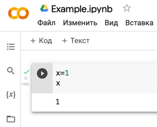

# Yandex Contest

<div align="center">
   
<a href=https://contest.yandex.ru/>

</a>

</div>

_Яндекс.Контест_ — сервис для онлайн-проверки заданий по программированию. Он предназначен для проведения состязаний любого уровня: олимпиады, соревнования международного класса, домашние задания. Его можно использовать также для подготовки к турнирам и для приёма экзаменов. Решения проверяются автоматически — с помощью набора тестов, составленных авторами заданий. Участники отправляют свои решения в тестирующую систему, а та выдает результат.

Мы предлагаем ознакомиться с краткой инструкцией по данной платформе, чтобы вы могли уделить свое время только решению задач.


## Инструкция

В конце каждой прослушенной лекции будут задачи на дом на данной платформе. 

Перейдя по ссылке к домашней работе, вам в первую очередь нужно будет авторизоваться на платформе через аккаунт в Яндексе.

<div align="center">

</div>

Если у вас нет аккаунта, то пройдите самую обычную процедуру регистрации.

<div align="center">

</div>

Далее вы увидите кнопку **регистрации**, по которой нужной перейти для выполнения задач.
> Обратите внимание, что на картинке изображен **обратный отсчет**. Но обычно мы не делаем ограничений по времени на сдачу домашнего задания.

<div align="center">

</div>

После старта вы увидите основную информацию о соревновании: название, количество оставшегося времени, кнопка досрочного завершения. Нас будет интересовать ссылка на решение задач.


<div align="center">

</div>

Основная информация о задаче представлена на картинке:


<div align="center">

</div>

Есть несколько типов _вердиктов_ после отправки вашего ответа: 
* **OK** — ответ/код правильный;
* **WA** — есть ошибка.

<div align="center">

</div>

И другие. Подробнее про них вы можете прочитать [здесь](https://contest.yandex.ru/errors/), а также ниже.

При этом стоит обратить внимание, что Система засчитывает задание решенным, если хотя бы одно из отправленных решений был верным (если не оговорено другое). После него вы можете отправлять хоть 10 неверных ответов, однако в системе все равно будет зафиксировано, что вы давали верный ответ.

Если вы закончили решать задачи раньше установленного времени, то можете **завершить** соревнование и сохранить ваши результаты:

<div align="center">

</div>

Если такой кнопки в контесте нет - ничего страшного - соревнование завершится автоматически по достижению дедлайна.

## Типы ошибок в Яндекс. Контест и способы их устранения.

Как уже было сказано выше, при отправке решений в Яндекс. Контест, тестовая система может не принимать решения, выдавая некоторую ошибку. Возможные типы ошибок с их краткими описаниями уже приводились [выше](https://contest.yandex.ru/errors/). Ниже будут более подробно разобраны некоторые ошибки и их возможные исправления.

### CE (Compilation Error)

Данная ошибка возникает, если ваша программа написана не по правилам языка Python. Попробуйте сначала запустить вашу программу в Google Collab. При этом обратите внимание на следующие моменты:

1.	Не нужно забывать про отступы. Не нужно делать никаких лишних отступов. При этом, в каждом блоке должно быть одинаковое количество пробелов в качестве отступов (рекомендуется использовать 4 пробела). В противном случае Яндекс. Контест выдаст ошибку CE (Compilation Error).
Например, ошибочным будет такой код:
``` python
x = 123
   print(x) # Ошибка будет здесь, т.к. перед print стоят лишние отступы
```
   
Также ошибка будет в таком фрагменте:

``` python
x = 1
if x==1:
    print("One")
else:
 print("Else")
# Ошибка будет здесь, т.к. во всех блоках программы должно быть одинаковое
# количество отступов, здесь внутри else перед print используется 1 отступ, хотя
# ранее после if перед print использовалось 4 отступа
```

2. Проверьте, что в качестве отступов везде используется либо только пробелы, либо только \t. Обратите внимание, что Tab не всегда равен 8 проблелам. \t и несколько пробелов – это разные символы. Поэтому если в программе для отступов используется и \t, и пробелы – система может выдать ошибку.
3. Не забывайте закрывать все скобки и кавычки. Например, ошибку CE вызывают следующие фрагменты кода: `print('str'`, `print('123)` и т.д.
4. Проверьте наличие двоеточия после строчки с `if, else, for, while` (`if x>y: `). 

### PE (Presentation error)

Данная ошибка может возникать, если формат вывода программы неверный.

При возникновении этой ошибки рекомендуется проверить следующее:

1. В Google Collab для вывода значения переменной достаточно указать просто её имя: 

<div align="center">

</div>

Это допущение сделано для упрощения разработки. В Яндекс. Контесте такого нет. Необходимо явно использовать `print()`, чтобы вывести значение переменной:
``` python
x=1
print(x)
```

2. Тестовая система проверяет ответ с эталонным **посимвольно**. Поэтому отличие *хотя бы в одном символе* может привести к ошибке. Поэтому перед отправкой решений проверяйте, что в программе нет лишних (или недостающих) пробелов, переходов на новую строку и других символов.
3. Лишним также могут быть вспомогательные сообщения, которые указываются в параметрах `input()` или `print()`, т.к. эти сообщения попадают в стандартный поток вывода и рассматриваются тестирующей системой как часть ответа.
Как правило, в задачах требуется просто ввести или вывести какие-то значения без каких-то дополнительных подсказок. 
Т.е. **не нужно писать** `input(“Введите число: ”)` или `print(“Искомый результат: ”, res)` (здесь res - некоторая переменная, показывающая результат работы программы). Нужно писать просто `input()` или `print(res)`.

### RE (Runtime error)

Самая частая ошибка. Возникает, если код написан в целом по правилам языка Python, однако в ходе выполнения программы обнаруживаются какие-то ошибки.
При возникновении этой ошибки следует проверить следующее:

1. Проверьте, что выполнены все рекомендации при возникновении ошибки **Presentation error** (эти же ситуации иногда могут приводить и к RE).
2. Попробуйте запустить код в *Google Collab* и самостоятельно поискать ошибку.
3. При использовании сторонних библиотек (`numpy`, `pandas`, `math`, `fractions`, `itertools` и др.) не забывайте делать соответствующий `import`:
``` python
import numpy as np
```
4. Если программа использует работу с файлами – проверьте **точное** совпадение имен входного и выходного файла в вашей программе с тем, что указано в условии.
5. Проверьте, что имена стандартных функций и арифметические операции записаны верно (при этом не забывайте, что Python чувствителен к регистру букв, т.е. `Print()` и `print()` – это разные функции). Например, `2^3` – неверная запись операции возведения в степень (нужно `2**3`). Аналогично, `Print('string')` – неверно, т.к. написано с большой буквы (верно `print('string')`). 
6. Не забывайте, сколько и каких параметров принимает каждая функция. Например, функция `write()` принимает только **одну строку** в отличие от `print()` (который принимает **сколько угодно параметров**, а также именованные параметры вроде sep и end). Так же функция `float()` принимает в качестве параметра строку, представляющую вещественное число, где в качестве разделителя используется **точка**, а не запятая. Т.е. запись `float("3,14")` приведёт к ошибке (нужно `float("3.14")`).
7. Проверьте, что нигде в вашей программе не может возникнуть деление на ноль при определённых входных данных или обращение к элементу списка/словаря с несуществующим индексом/ключом (например, для `lst=[1, 2, 3]` обращение `lst[500]` вызовет ошибку, т.к. элемента с индексом 500 в списке нет. Аналогично, для словаря `d = {‘cat’: 3, ‘lion’: 2, ‘dog’: 7}` вызовет ошибку обращение `d[‘mouse’]` (т.к. такого ключа в словаре нет)).
